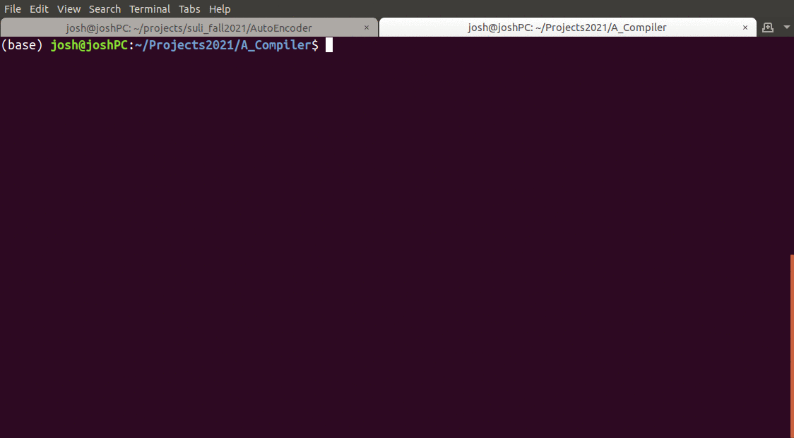

# A_Compiler

## Current State of the Project:
    - Scanner      (COMPLETED)
    - Symbol Table (ACTIVE)
    - Parser       (ON DECK)

## Functionality:
    - 03/03/2021: 
        * Read source file
        * Recognize lexemes and generate a Token Stream
        * Prints stream to terminal

## Linux Build:
```bash
mkdir build
cd build
cmake ..
make
./ac <input_file>
```

